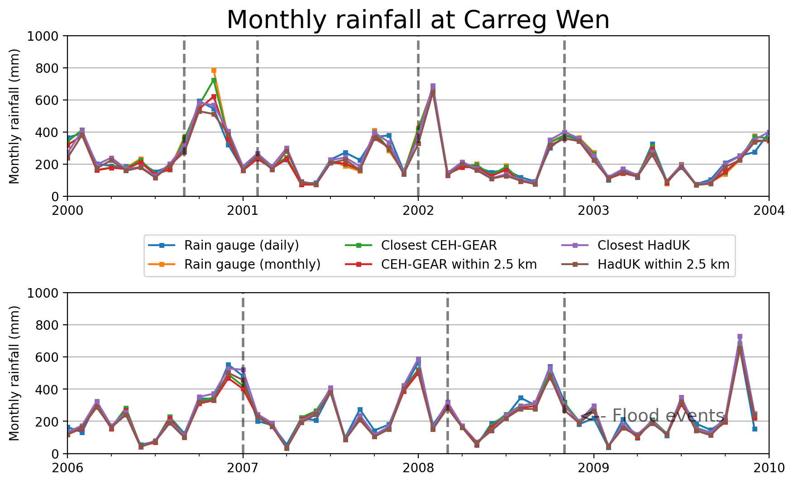
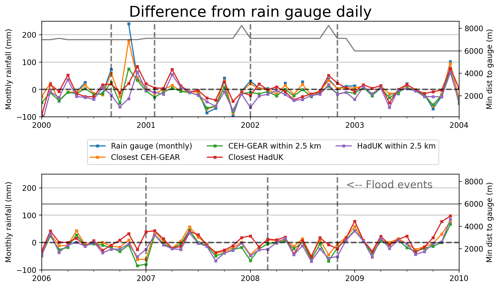
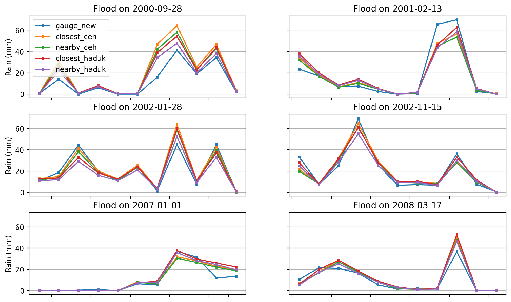
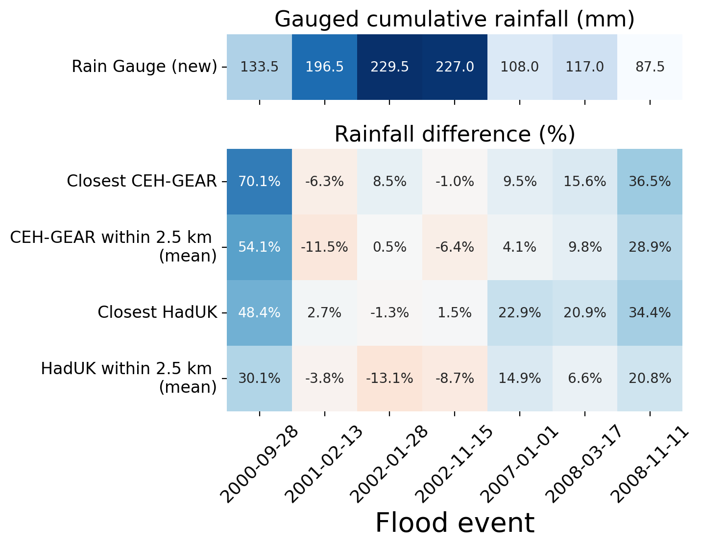
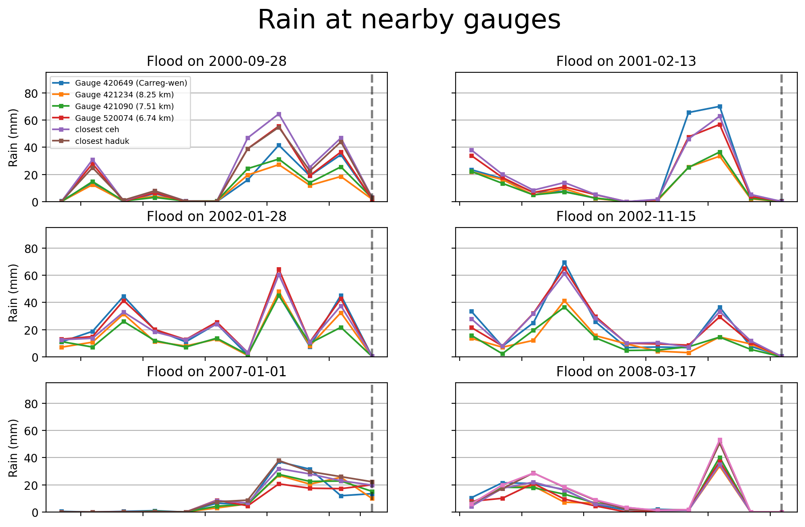
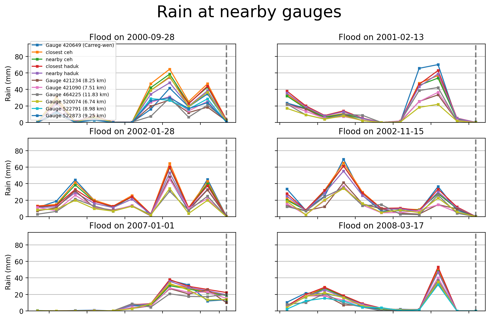
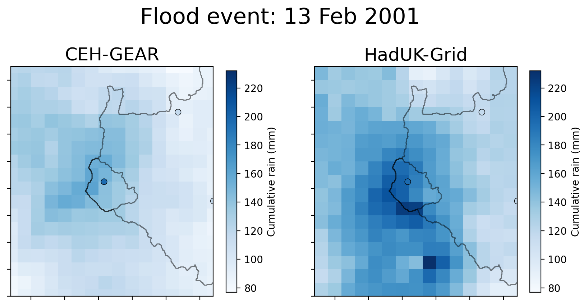

# FDRI-comparing-rainfall-data-in-upper-severn
Project comparing rainfall estimates in the Upper Severn using rain gauges and gridded rainfall products. The two main gridded rainfall products available in the UK are the CEH-GEAR and HadUK-Grid, both of which have been extracted on a 1km by 1km grid.

This work was carried out as part of the [Floods and Droughts Research Infrastructure](https://fdri.org.uk/) (FDRI) project led by the UK Centre for Ecology & Hydrology.

### The Upper Severn

## Factors contributing to differences between CEH-GEAR & HadUK-Grid
### Reduction in daily rain gauges in Upper Severn
In the 1980s there used to be more rain gauges in the Upper Severn.

Red circles represent daily rain gauges around the Abermule catchment.

### Gridding methods
Rain gauge data is interpolated onto a regular grid. The exact gauges which are included differ based on gridded rainfall product.

Example of rain gauge data onto a regular grid:  

CEH-GEAR uses [Natural Neighbour Interpolation](https://en.wikipedia.org/wiki/Natural-neighbor_interpolation), HadUK-Grid uses [Inverse Distance Weighting](https://en.wikipedia.org/wiki/Inverse_distance_weighting).

Differences will be subtle, but the choice of spatial interpolation creates uncertainty.
Below a figure shows the differences between spatial interpolation methods (for more see: [DOI:10.5772/65996](https://www.intechopen.com/chapters/52704)):  

### Quality control procedures on the inclusion of rain gauges data
Figure below compares annual differences in mean rainfall between CEH-GEAR and HadUK. Positive (red) values represent higher rainfall in CEH-GEAR than HadUK-Grid. Outlines represent the Abermule (largest), Dolwen and Plynlimon Flume (smallest) catchment boundaries

### Cumulative rainfall comparing gauged and gridded rainfall over Carreg Wen
*Dashed-lines represent flood dates*

### Cumulative rainfall difference from rain gauge
*Dashed-lines represent flood dates*

## Severn-wide flood events at Carreg Wen

### Cumalative rainfall
*including the sum of rain 10-0 days before the event*

### Nearby rain gauges
There are not many rain gauges active near Carreg-wen

### Maps of floods
More maps available under `figures/`
