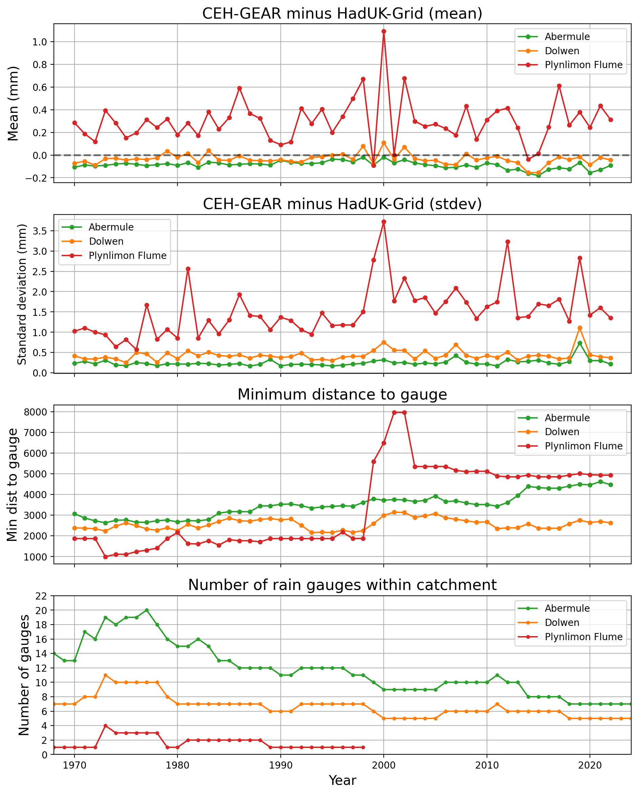
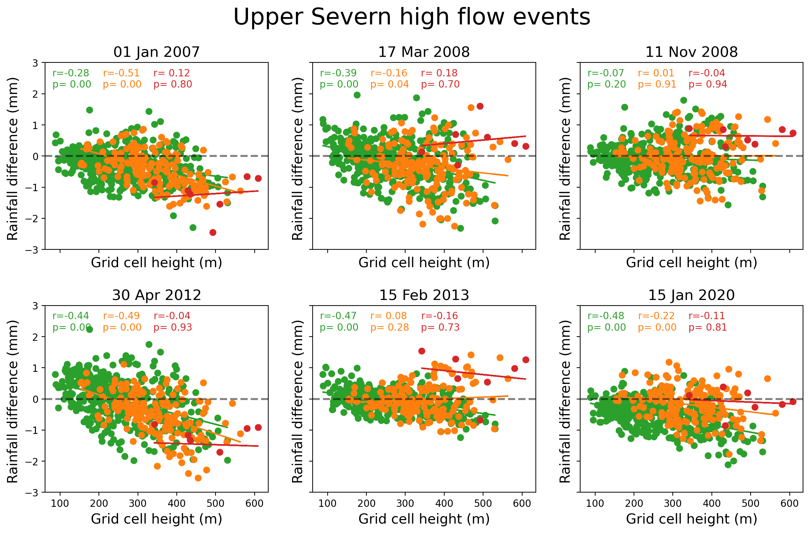
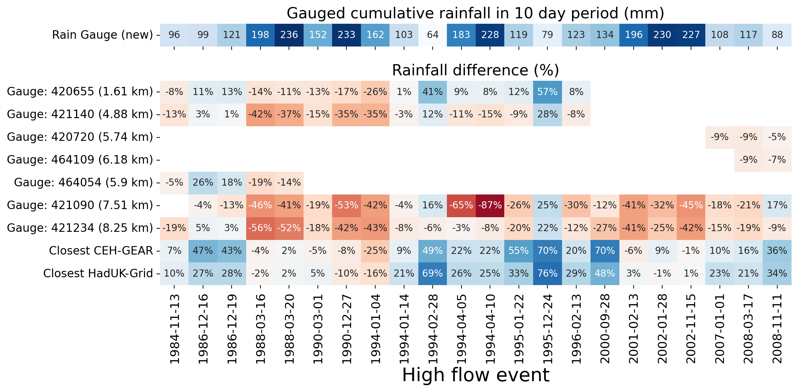

# FDRI-comparing-rainfall-data-in-upper-severn

## Introduction

Project comparing rainfall estimates in the Upper Severn using data from rain gauges and gridded rainfall products.

**Project Goals:**

1. To reduce the uncertainty of rain-driven flood estimates in the upper reaches of the Severn catchment.
2. To quantify the differences between the CEH-GEAR and HadUK-Grid within a river catchment.

## **Headline Findings**

_CEH-GEAR vs HadUK-Grid:_

- There is a spatial pattern to the difference between rainfall estimates from the CEH-GEAR and HadUK-Grid (**Figures 5 & 7**).
- There is CEH-GEAR bias towards source of Severn at Plynlimon, but general HadUK-Grid bias at higher altitudes (**Figures 6 & 8**).
- Distance to the nearest rain gauge less important for dataset differences than height at grid cell (**Figures 9 & 12**).

_Changes in the rain gauges network:_

- The relationship between the density of the rain gauges network and dataset differences is uncertain. There has been a decrease in the number of daily rain gauges in the Upper Severn, and this has lead to slight increase in the variability (stdev) of rainfall bias between CEH-GEAR and HadUK-Grid in catchments where and when there are decreases in rain gauges (**Figures 2 & 10**).

_Rainfall estimates during high-flow events:_

- There is a tendancy for HadUK-Grid bias in the rainfall estimate at higher altitudes during high flow events (**Figure 13**).
- Introducing data from an unused rain gauge highlighted that there are periods where the gridded data products far overestimates rainfall during high flow events (**Figure 16**), and that there is quite a lot of variability between the estimates of the new gauge and the rain gauges within a 10 km radius of the new gauge (**Figure 17**)

## Index

- [1. Data](#1-data)
- [2. Study area: The Upper Severn](#2-study-area-the-upper-severn)
  - [2.1. Factors contributing to differences in gridded rainfall products in region](#21-factors-contributing-to-differences-between-ceh-gear--haduk-grid-over-upper-severn)
- [3. Methods](#3-methods)
  - [3.1 Masking catchment](#31-catchment-masks)
  - [3.2. Height profile](#32-height-profile)
- [4. Results](#4-results)
  - [4.1. Differences between gridded datasets in Upper Severn](#41-differences-between-gridded-datasets-in-upper-severn)
  - [4.2. Dataset uncertainty during Severn high flow events](#42-dataset-uncertainty-during-severn-high-flow-events)
  - [4.3. Carreg Wen case study](#43-carreg-wen-case-study)
- [5. Future work](#5-future-work)
- [6. Technical note, further reading, credits](#6-endnotes)

# 1. Data

**UK gridded rainfall products**  
The two main observation-based gridded rainfall products available for the UK are the CEH-GEAR (available [here](https://catalogue.ceh.ac.uk/documents/dbf13dd5-90cd-457a-a986-f2f9dd97e93c)) and HadUK-Grid (available [here](https://catalogue.ceda.ac.uk/uuid/4dc8450d889a491ebb20e724debe2dfb/)). We used daily 1km by 1km rainfall between 1 Jan 1970 and 31 Dec 2022 from each of these products. A spatial and time subset of these dataset was extracted from UKCEH servers and CEDA JASMIN respectively.

**Daily rain gauge data**  
This has been extracted from internal UKCEH servers, and includes quality controlled data from Met Office rain gauges. This data is available in `gauge_data/`.

**NRFA catchment boundaries**  
Downloaded from NRFA ([link](https://nrfa.ceh.ac.uk/data/search))

**Rivers shapefile**  
Downloaded from OS OpenRivers ([link](https://www.ordnancesurvey.co.uk/products/os-open-rivers))

🌲 _I am happy to provide any of the above data (or any related info), so please feel free to email [me](mailto:tomkee@ceh.ac.uk)._ 🌲

# 2. Study area: The Upper Severn

We use three NRFA catchments towards the source of the River Severn: [Abermule](https://nrfa.ceh.ac.uk/data/station/info/54014) (flow gauge at: 86.8 m), [Dolwen](https://nrfa.ceh.ac.uk/data/station/info/54080) (147.3 m) and [Plynlimon Flume](https://nrfa.ceh.ac.uk/data/station/info/54022) (321.3 m).

_**Figure 1.** The three catchment used in this study of the Upper Severn_

## 2.1 Factors contributing to differences between CEH-GEAR & HadUK-Grid over Upper Severn

### 2.1.1 A reduction in daily rain gauges in Upper Severn

On 1 January 1980 there were more rain gauges in the Upper Severn around Abermule than on 1 January 2022 (**Figure 2**).
Additionally, the proportion of rain gauges used in both the daily and monthly CEH-GEAR product becomes 100% in 2022.

_**Figure 2.** Number of daily rain gauges around Abermule. Red circles represent daily-only rain gauges, yellow circles represent gauges used in daily and monthly CEH-GEAR product._

### 2.1.2 Difference of methods used to grid the rain gauge data

Rain gauge data is interpolated onto a regular grid differently by the two gridded products (see **Figure 3**). CEH-GEAR uses [Natural Neighbour Interpolation](https://en.wikipedia.org/wiki/Natural-neighbor_interpolation), HadUK-Grid uses [Inverse Distance Weighting](https://en.wikipedia.org/wiki/Inverse_distance_weighting).
The differences will be subtle, but the choice of spatial interpolation creates uncertainty (see: [DOI:10.5772/65996](https://www.intechopen.com/chapters/52704)).
Notably, neither of the methods provide an assessment of spatial error that something kriging would provide. Further reading about the case for account for spatial errors during interpolation available [here](https://iri.columbia.edu/~rijaf/CDTUserGuide/html/interpolation_methods.html)

_**Figure 3.** Example of spatial interpolation of rain gauges network to a regular grid_

Another issues is that the exact gauges which are included differ based on gridded rainfall product.
The reduction in density of the rain gauge network in the Upper Severn (shown in **Figure 2**) puts more uncertainty into the rainfall estimation, and means larger differences are created by the exact methods used to spatially interpolate data from rain gauges to a regular grid (e.g. 1km by 1km).

### 2.1.3 Difference in quality control procedures

Both datasets uses differing QC procedures, and may included different rain gauges at different time steps.
The QC methodologies are noted in the following sections of the data paper:
CEH-GEAR (Section 4 of [Keller et al. 2015](https://doi.org/10.5194/essd-7-143-2015)) & HadUK-Grid (Section 2.2 of [Hollis et al. 2019](https://rmets.onlinelibrary.wiley.com/doi/10.1002/gdj3.78))

🌲 _I am happy to discuss the QC protocols further, and a more robust rain QC protocol for hourly data is provided in [Lewis et al. 2021](https://doi.org/10.1016/j.envsoft.2021.105169)_ 🌲

# 3. Methods

Notebooks provided in `notebooks/` detail how the analysis and figures were produced.

## 3.1 Catchment masks

We mask the areas around each catchment (see example in **Figure 6**). More details of masking is provided in _Section 4_ of `notebooks/explore_upper_severn_flood_events.ipynb`.

## 3.2 Height profile

We also use a 1km by 1km height profile for the region (**Figure 4**). This was extracted using 50 metre OS topography data and clipping by extent in QGIS. The data was then exported to a 1km by 1km grid.

_**Figure 4.** Height profile in metres of the Upper Severn catchment_

# 4. Results

## 4.1 Differences between gridded datasets in Upper Severn

The Abermule catchment encompasses the other two, and in this wider catchment there is larger HadUK-Grid bias (**Figure 5**). However, there is a longer tail in the CEH-GEAR bias, likely attributed to grid cells in areas in the smaller catchments of Dolwen and Plynlimon Flume.

_**Figure 5** Histogram of differences between CEH-Gear and HadUK in Upper Severn. Histogram bins are every 5 mm difference._

There is a clear spatial pattern of bias shown in the upper severn (**Figure 6**), and this pattern is not seasonally dependent (**Figure 7**). Most of the CEH bias is towards Plynlimon Flume where towards the highest reaches of the Severn river.  

_**Figure 6** Mean dataset difference in the Upper Severn using a region mask._

_**Figure 7** Seasonal dataset differences in the Upper Severn between 1 Jan 1970 and 31 Dec 2022._

### 4.1.1 Is there a relationship between gridded data differences and altitude or distance to rain gauge?

Next, we examine some simple relationships between grid cell height, gridded data differences and minimum distances to the nearest rain gauge (CEH-GEAR only).

A slight negative correlation is shown between grid cell height and rainfall differences in Abermule, but not for the other catchments (**Figure 8**). A similar pattern is shown between the minimum distance to the nearest rain gauge and rainfall differences (**Figure 9**).
Comparison between grid cell height and min distance are shown in this [figure](figures/ceh_vs_haduk_differences/uppersevern_height_vs_mindist_scatter.png) (in that there is a strong positive correlation between height and min dist in both Dolwen and Plynlimon).

_**Figure 8** Rainfall data difference vs height of grid cell (mean of 1 Jan 1970 to 31 Dec 2022). Height was dervied from a 1 km by 1 km profile detailed in **Section 3.2**. Statistic and p-value from Pearson's r correlation._

_**Figure 9** Rainfall data difference vs minimum distance to gauge from CEH-GEAR (mean of 1 Jan 1970 to 31 Dec 2022). Statistic and p-value from Pearson's r correlation._

### 4.1.2 Is there temporal relationship between gridded data differences and the distances to gauge or altitude?

Grid cells within Plynlimon Flume have consistently been associated with a rainfall estimate with a CEH-GEAR bias (_first panel_ of **Figure 10**).
Notably, when the the minimum distance to the nearest gauge jumped in 1998, the mean and standard deviation of the dataset difference jumped too (_second_ and _third panel_ of **Figure 10**).

There has been a gradual reduction in the number of gauges in the Upper Severn (_fourth panel_ of **Figure 10**) and this has coincided with a slight jump in the variability of the difference between CEH-GEAR & HadUK-Grid in Plynlimon and to a lesser extent Abermule, especially since 2010 (_second panel_ of **Figure 10**). No pattern or change in min dist to gauge was shown in Dolwen, and this is also the catchment with the lowest relative change in gauges.

A version of this plot without Plynlimon Flume is available [here](figures/ceh_vs_haduk_differences/ceh_vs_haduk_thru_time_wo_plyn.png)

_**Figure 10** Comparison of dataset differences and inputted rain gauge information across the study period. Data is annual mean._

### Code for these figures

- Information about how the above plots were produced is provided in [notebooks/explore_differences_in_gridded_datasets.ipynb](./notebooks/explore_differences_in_gridded_datasets.ipynb)\_

## 4.2 Dataset uncertainty during Severn high flow events

We examine 6 major Severn-wide high flow events between 2000-2008. High flow events are defined as [gauged daily flow](https://nrfa.ceh.ac.uk/data/about-data/daily-flow-data/gauged-daily-flow-data) above the 95th percentile in each of the [Bewdley](https://nrfa.ceh.ac.uk/data/station/info/54001), [Buildwas](https://nrfa.ceh.ac.uk/data/station/info/54095) and [Montford](https://nrfa.ceh.ac.uk/data/station/info/54005) catchments. By focusing on three catchments, we hope to caputre events that co-occured across the Severn.

There is no clear spatial pattern of dataset uncertainty about rainfall leading up to high flow events in the Upper Severn (**Figure 11**).
However, there is slightly more uncertainty towards high altitude regions (**Figure 4**), with no clear trend in CEH or HadUK bias.

For a further six high flow events see this [figure](figures/upper_severn_floods/uppersevern_flood_events_differences_6other.png). And to see a map of minimum distances to gauge during these events see this [figure](figures/upper_severn_floods/uppersevern_flood_events_mindist.png).

_**Figure 11** High flow events over the Upper Severn. In each case, a dated event is the mean of 10 to 0 days before it. Circle represent rain gauges and their color represents their difference from the nearest grid cell of the CEH-GEAR dataset._

### 4.2.1 Is there relationship between gridded data differences for these high flow events and the distances to gauge or altitude?

There is no consistent pattern between the difference in rainfall in CEH-GEAR vs HadUK-Grid and minimum distance to gauge (**Figure 12**) in any of the three catchments.

However, there is a tendancy for HadUK-Grid bias in the rainfall estimate at higher altitudes as shown by negative correlation (**Figure 13**).
Although this trend does not hold in the high altitude Plynlimon catchment.

_**Figure 12** Comparison between minimum distance to gauge and gridded data differences in the grid cells of each of the three Upper Severn catchments. In each case, a dated event is the mean of 10 to 0 days before it. Statistic and p-value from Pearson's r correlation._

_**Figure 13** Comparison between grid cell height and gridded data differences in the grid cells of each of the three Upper Severn catchments. In each case, a dated event is the mean of 10 to 0 days before it. Statistic and p-value from Pearson's r correlation._

### Code for these figures

- Information about how the above plots were produced is provided in [notebooks/explore_differences_in_gridded_datasets.ipynb](./notebooks/explore_upper_severn_high_flow_events.ipynb)

## 4.3 Carreg Wen case study

The rain gauge at Carreg Wen is situated in the middle of the Plynlimon catchment area, and was included in both the CEH-GEAR and HadUK-Grid until 1988. In this final example, we use infilled quality-controlled data from the Carreg Wen gauge extending 1970-2010 (currently unseen by CEH-GEAR or HadUK-Grid).

The pattern of dataset bias during high flow events is not uniform through time (**Figure 14**).
In the Upper Severn CEH-GEAR bias was particularly strong towards Plynlimon in the period 1984-1988 (when Carreg Gauge was active), and then between 2000-2002 (after the final rain gauge was removed from the Plynlimon Flume catchment; i.e. see _third panel_ of **Figure 10**).

See a version of **Figure 14** for minimum distances to gauges during these time periods [here](figures/upper_severn_floods/uppersevern_flood_event_mean_mindist.png).

_**Figure 14** Rainfall differences during high flow events in four time periods: 1984-1988 (when the old Carreg wen rain gauge was used); 1990-1996 (whilst 1 rain gauge remained in Plynlimon Flume); 2000-2002 (a period of higher dataset uncertainty in Plynlimon) & 2007-2020 (a period of low dataset uncertainty in Plynlimon)_

### 4.3.1 Comparing new Carreg Wen gauge to nearby gridded data

CEH-GEAR and HadUK-Grid rainfall estimates tend to be closer to each other than the new rain gauge (**Figure 15**).  
For the six high flow event examined in **Figure 15**, rainfall tends to be highest 2-4 days before a Severn-wide high flow event.

When viewing all 22 high flow event discovered between 1984-2010
(**Figure 16**), there are clear periods where the gridded products are wetter or drier including a period between 1994-2000 where rainfall during high flow events were significantly overestimated by HadUK-Grid and CEH-GEAR. In terms of similarities to either gridded product, there is no consistent pattern, with HadUK-Grid being more closely allign in some periods, and CEH-GEAR in others (also see this [figure](figures/carreg_wen_case_study/annual_mean_rainfall_comparison_new_gauge.png))

_**Figure 15** Comparison between rain estimates from the new Carreg Wen gauge and the nearby and closest CEH-GEAR and HadUK-Grid 1km cells. The lines represent the leading 10 days before a high flow event and each marker in the line represents a day._

_**Figure 16** Comparison between gridded datasets and the unseen Carreg Wen gauge. Rainfall differences are relative to the gauged 10 day sum rainfall of the new Carreg Wen gauge. Blue values represent wetter than Carreg Wen, and red values represent drier._

### 4.3.2 Comparing new Carreg Wen gauge to other nearby gauges which are used in CEH-GEAR

For most of relatively wetter high flow events, the new gauge at Carreg Wen produces higher rainfall estimates than in all the other rain gauges within 10 km (**Figure 17**).
Despite being the closest gauge to Carreg Wen, gauge 420655 still is regularly at least 10% different.
Equally, those gauges further way tend to even more different.

_**Figure 17** Comparison between the unseen Carreg Wen gauge and nearby gauges that are used in the CEH-GEAR. Rainfall differences are relative to the gauged 10 day sum rainfall of the new Carreg Wen gauge. Blue values represent wetter than Carreg Wen, and red values represent drier._

_more figures available under `figures/carreg_wen_case_study`_

### Code for these figures

- Information about how the above plots were produced is provided in [notebooks/explore_differences_in_gridded_datasets.ipynb](./notebooks/Carreg_wen_case_study.ipynb)\_

# 5. Future work

- There are time periods when bias leans towards either CEH-GEAR or HadUK-Grid in the Upper Severn. Why is this?
- Are there certain rain gauges that lead to greater changes in the difference between datasets when included or not? And are there certain locations more important to monitor for high-flow events?
- How do differences in spatial interpolation methods affect the rainfall estimates? Would kriging provide a better assessment of the uncertainties?
- There is an uncertainty around how much rainfall falls above certain heights above rain gauges, especially around Plynlimon and the source of the Severn during high-flow events . See project examining influence of height on rainfall estimation in gridded rainfall products [here](#https://github.com/Thomasjkeel/FDRI-catchment-contribution-to-floods).

# 6. Endnotes

## Technical note

There are few heavier libraries used in this project that may be awkward for new users, but are commonly-used libraries for dealing with multi-dimensional (spatial) data in Python. These are:

| library   | use                                 | version  |
| --------- | ----------------------------------- | -------- |
| xarray    | loading, subsetting, multi-dim data | 2025.1.1 |
| pandas    | loading data                        | 2.2.3    |
| polars    | loading data (fast)                 | 1.19.0   |
| geopandas | loading shapefiles                  | 1.0.1    |
| rioxarray | loading raster data                 | 0.18.2   |
| shapely   | spatial operations                  | 2.0.6    |
| seaborn   | plotting                            | 0.13.2   |
| scipy     | statistics                          | 1.15.0   |

## Further reading

- https://github.com/Thomasjkeel/FDRI-catchment-contribution-to-floods

## Disclaimer

_We have only used rain gauge information related to the CEH-GEAR product_

## Credits

_This work was carried out as part of the [Floods and Droughts Research Infrastructure](https://fdri.org.uk/) (FDRI) project led by the UK Centre for Ecology & Hydrology._
