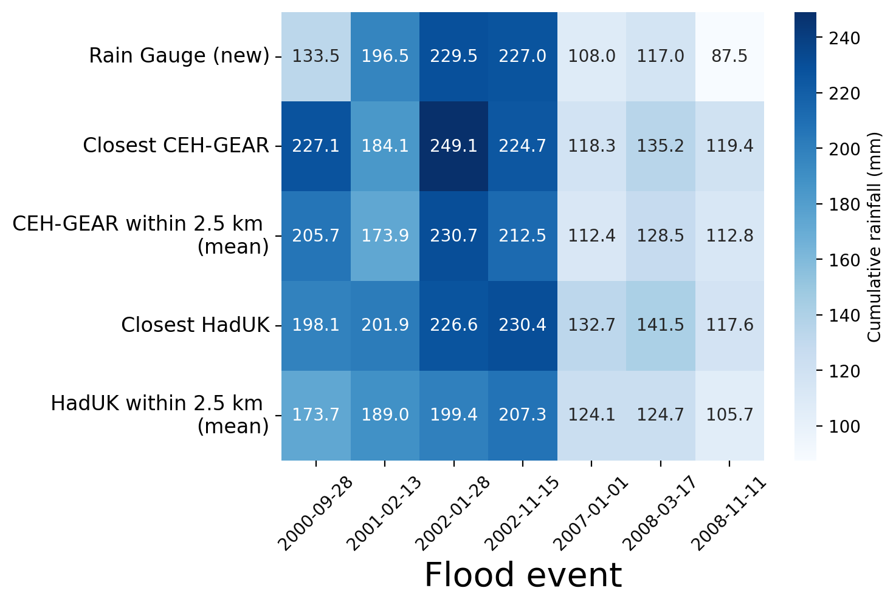

# FDRI-catchment-gauge-vs-grid
Selection of notebooks comparing gauged rainfall data to gridded rainfall products (CEH-GEAR and HadUK-Grid)

### Monthly rainfall at Carreg Wen
##### Cumulative rainfall comparing gauged and gridded rainfall over Carreg Wen
*Dashed-lines represent flood dates*

##### Cumulative rainfall difference from rain gauge
*Dashed-lines represent flood dates*

### Severn-wide flood events at Carreg Wen

##### Cumalative rainfall
*including the sum of rain 10-0 days before the event*

