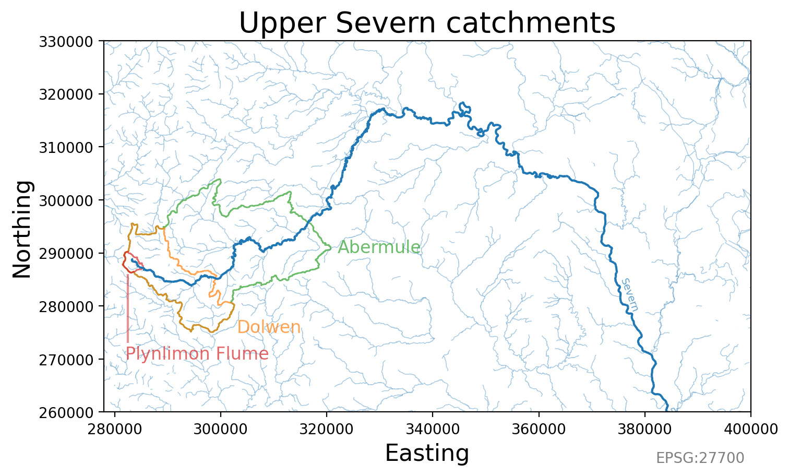
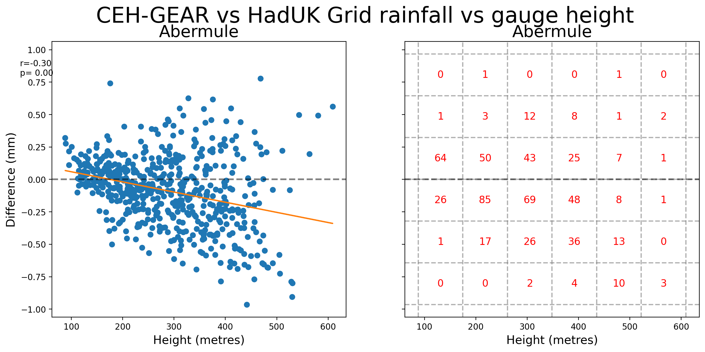

# FDRI-comparing-rainfall-data-in-upper-severn
Project comparing rainfall estimates in the Upper Severn using rain gauges and gridded rainfall products. The two main gridded rainfall products available in the UK are the CEH-GEAR and HadUK-Grid, both of which have been extracted on a 1km by 1km grid.

**Project Goal:** To reduce the uncertainty of rain-driven flood estimation in the upper reaches of the Severn catchment.

*This work was carried out as part of the [Floods and Droughts Research Infrastructure](https://fdri.org.uk/) (FDRI) project led by the UK Centre for Ecology & Hydrology.*

## The Upper Severn
We examine three catchments towards the source of the River Severn:  [Abermule](https://nrfa.ceh.ac.uk/data/station/info/54014) (flow gauge at: 86.8 m), [Dolwen](https://nrfa.ceh.ac.uk/data/station/info/54080) (147.3 m) and [Plynlimon Flume](https://nrfa.ceh.ac.uk/data/station/info/54022) (321.3 m). 

# Factors contributing to differences between CEH-GEAR & HadUK-Grid
## Reduction in daily rain gauges in Upper Severn
In the 1980s there used to be more rain gauges in the Upper Severn (see figure below):
*Red circles represent daily rain gauges around the Abermule catchment available and used in the CEH-GEAR data product.*

## Gridding methods
Rain gauge data is interpolated onto a regular grid. The exact gauges which are included differ based on gridded rainfall product.

Example of rain gauge data onto a regular grid:  

CEH-GEAR uses [Natural Neighbour Interpolation](https://en.wikipedia.org/wiki/Natural-neighbor_interpolation), HadUK-Grid uses [Inverse Distance Weighting](https://en.wikipedia.org/wiki/Inverse_distance_weighting).

Differences will be subtle, but the choice of spatial interpolation creates uncertainty.
Below a figure shows the differences between spatial interpolation methods (for more see: [DOI:10.5772/65996](https://www.intechopen.com/chapters/52704)):  

## Quality control procedures on the inclusion of rain gauges data
TODO...

# Exploring differences
## Methods
We mask the areas around each catchment

## Results
Clearly there is a bias in certain regions
 

Histogram of differences between CEH-Gear and HadUK in Upper Severn:  

Abermule rainfall difference between CEH-GEAR and HadUK vs Height of rain gauge.
Moderate negative correlation shown.

Abermule rainfall difference between CEH-GEAR and HadUK vs Height of rain gauge.
No relationship shown.

Abermule rainfall difference between CEH-GEAR and HadUK vs Height of rain gauge:
Weak negative correlation shown.

# Influence of gridded data differences during floods
We examine 5 major Severn-wide high flow events (i.e. those above 95th percentile in each of the Abermule, Plynlimon, Bewdley, Buildwas and Dolwen catchments).
TODO...

# Other
Figure below compares annual differences in mean rainfall between CEH-GEAR and HadUK. Positive (red) values represent higher rainfall in CEH-GEAR than HadUK-Grid. Outlines represent the Abermule (largest), Dolwen and Plynlimon Flume (smallest) catchment boundaries
