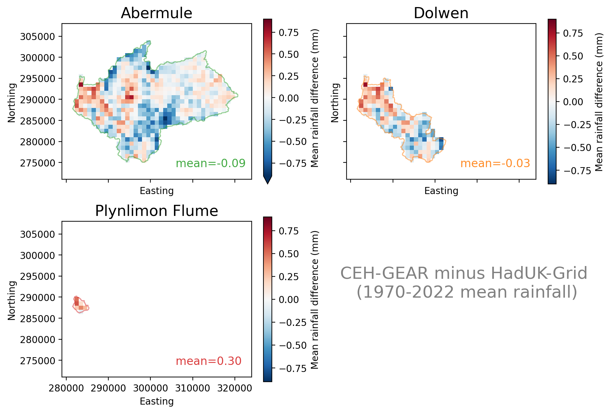
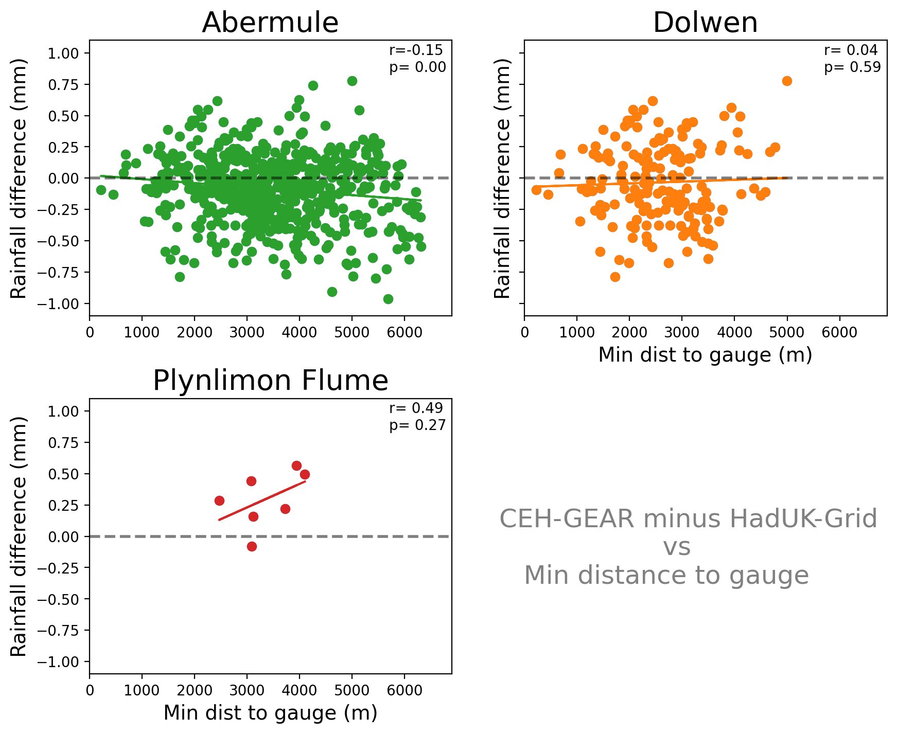
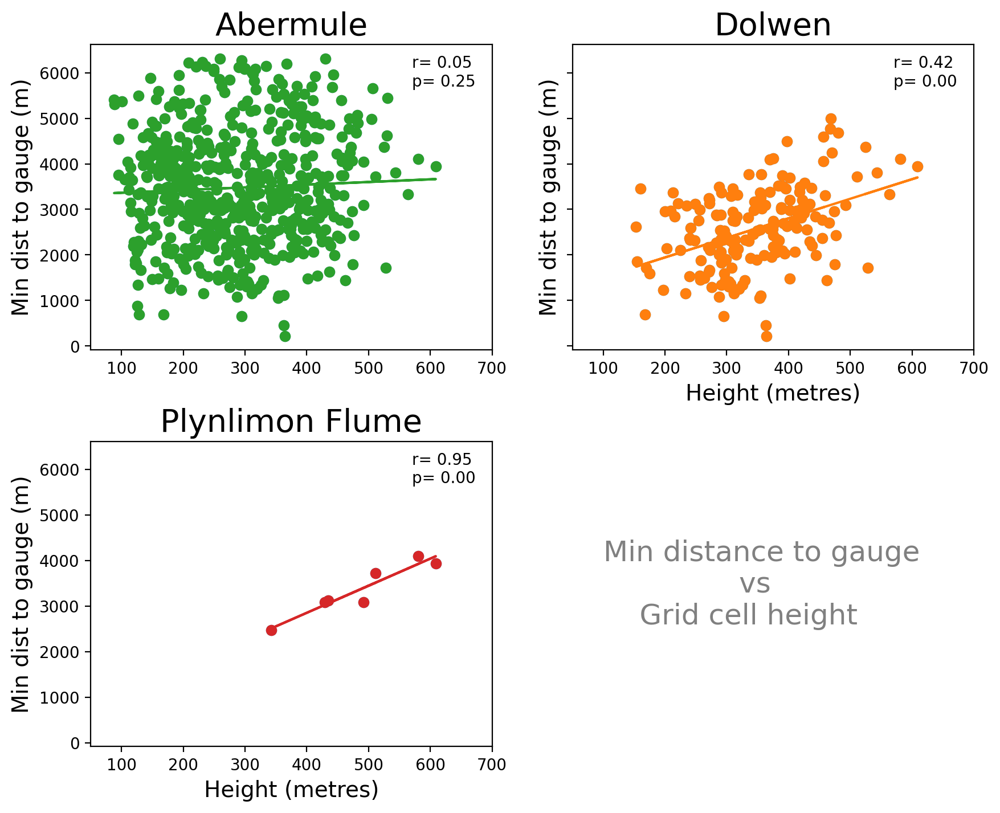

# FDRI-comparing-rainfall-data-in-upper-severn

## Introduction

Project comparing rainfall estimates in the Upper Severn using rain gauges and gridded rainfall products.

**Project Goals:**

1. To reduce the uncertainty of rain-driven flood estimation in the upper reaches of the Severn catchment.
2. To quantify the differences between the CEH-GEAR and HadUK-Grid within a river catchment.

## **Headline Findings**

TODO

- There is a spatial signature to the difference between CEH-GEAR and HadUK-Grid (**Figures X, X** & **X**)
- The relationship between changes to the density of rain gauges to differences between gridded data products is uncertain, but there has been a decrease in the number of daily rain gauges in the Upper Severn (**Figure 2**), alongside a relationship between X and X (**Figures X, X** & **X**).

## Index

- [1. Data](#1-data)
- [2. Study area: The Upper Severn](#2-study-area-the-upper-severn)
  - [2.1. Factors contributing to differences in gridded rainfall products in region](#21-factors-contributing-to-differences-between-ceh-gear--haduk-grid-over-upper-severn)
- [3. Methods](#3-methods)
  - [3.1 Masking catchment](#31-catchment-masks)
  - [3.2. Height profile](#32-height-profile)
- [4. Results](#4-results)
  - [4.1. Differences between gridded datasets in Upper Severn](#41-differences-between-gridded-datasets-in-upper-severn)
  - [4.2. Dataset uncertainty during Severn high flow events](#42-dataset-uncertainty-during-severn-high-flow-events)
  - [4.3. Carreg Wen case study](#43-carreg-wen-case-study)
- [5. Discussion](#5-discussion)
- [6. Technical note, further reading, credits](#6-endnotes)

# 1. Data

**UK gridded rainfall products**  
The two main observation-based gridded rainfall products available for the UK are the CEH-GEAR (available [here](https://catalogue.ceh.ac.uk/documents/dbf13dd5-90cd-457a-a986-f2f9dd97e93c)) and HadUK-Grid (available [here](https://catalogue.ceda.ac.uk/uuid/4dc8450d889a491ebb20e724debe2dfb/)).  
For this project, we use daily 1km by 1km rainfall from each of these products, which we have extracted from UKCEH servers and CEDA JASMIN respectively.

**Daily rain gauge data**  
This has been extracted from internal UKCEH servers, and includes quality controlled data from Met Office rain gauges. This data is available in `gauge_data/`.

**NRFA catchment boundaries**  
Downloaded from NRFA ([link](https://nrfa.ceh.ac.uk/data/search))

**Rivers shapefile**  
Downloaded from OS OpenRivers ([link](https://www.ordnancesurvey.co.uk/products/os-open-rivers))

_I am happy to provide any of the above data (or any related info), so please feel free to email [me](mailto:tomkee@ceh.ac.uk)._

# 2. Study area: The Upper Severn

We examine three catchments towards the source of the River Severn: [Abermule](https://nrfa.ceh.ac.uk/data/station/info/54014) (flow gauge at: 86.8 m), [Dolwen](https://nrfa.ceh.ac.uk/data/station/info/54080) (147.3 m) and [Plynlimon Flume](https://nrfa.ceh.ac.uk/data/station/info/54022) (321.3 m).

_<strong>Figure 1.</strong> The three catchment used in this study of the Upper Severn_

## 2.1 Factors contributing to differences between CEH-GEAR & HadUK-Grid over Upper Severn

### 2.1.1 A reduction in daily rain gauges in Upper Severn

On 1 January 1980 there were more rain gauges in the Upper Severn around Abermule than on 1 January 2022 (see **Figure 2**).
Additionally, the proportion of rain gauges used in both the daily and monthly CEH-GEAR product becomes 100% in 2022.

_<strong>Figure 2.</strong> Number of daily rain gauges around Abermule. Red circles represent daily-only rain gauges, yellow circles represent gauges used in daily and monthly CEH-GEAR product._

### 2.1.2 Difference of methods used to grid the rain gauge data

Rain gauge data is interpolated onto a regular grid. The exact gauges which are included differ based on gridded rainfall product.  
The reduction in density of the rain gauge network in the Upper Severn (shown in **Figure 2**) puts more uncertainty into the rainfall estimation, and means greater differences are created by the exact methods used to spatially interpolate data from rain gauges to a regular grid (e.g. 1km by 1km).

<!-- Example of rain gauge data onto a regular grid:
 -->

CEH-GEAR uses [Natural Neighbour Interpolation](https://en.wikipedia.org/wiki/Natural-neighbor_interpolation), HadUK-Grid uses [Inverse Distance Weighting](https://en.wikipedia.org/wiki/Inverse_distance_weighting).

Differences will be subtle, but the choice of spatial interpolation creates uncertainty.
Below a figure shows the differences between spatial interpolation methods (for more see: [DOI:10.5772/65996](https://www.intechopen.com/chapters/52704)):

<!--  -->

### 2.1.3 Difference in quality control procedures

Both datasets uses differing QC procedures, and may included different rain gauges at different time steps.

# 3. Methods

Notebooks provided in `notebooks/` detail how the analysis and figures were produced.

## 3.1 Catchment masks

We mask the areas around each catchment (see example in **Figure X**).  
Details provided in _Section 4_ of `notebooks/explore_upper_severn_flood_events.ipynb`.

## 3.2 Height profile

We also use a 1km by 1km height profile for the region (see figure below)  

_<strong>Figure 3.</strong> Height profile in metres of the Upper Severn catchment_

# 4. Results

## 4.1 Differences between gridded datasets in Upper Severn

_Note: information about how these plots were produced is provided in [notebooks/explore_differences_in_gridded_datasets.ipynb](./notebooks/explore_differences_in_gridded_datasets.ipynb)_

_<strong>Figure X</strong> Histogram of differences between CEH-Gear and HadUK in Upper Severn_

Clearly greater bias towards Plynlimon.  

_<strong>Figure X</strong> caption._

But there is opposing relationship between height of gauge and differences between CEH-GEAR and HadUK-Grid  

_<strong>Figure X</strong> Rainfall difference between datasets vs Height of rain gauge._

Similarly there is no clear pattern between dataset differences and distances of a grid cell to the nearest rain gauge (see below).  

_<strong>Figure X</strong> Rainfall difference between CEH-GEAR and HadUK-Grid versus minimum distance to gauge (from CEH-GEAR)._

_<strong>Figure X</strong> Height of rain gauge versus minimum distance to gauge._

Through time  

_<strong>Figure X</strong>_

Without Plynlimon:  

_<strong>Figure X</strong>_

### Interpretation:

- perhaps we are using too much data in one go to compare differences.
- there is some indication that

# 4.2 Dataset uncertainty during Severn high flow events

_Note: information about how these plots were produced is provided in [notebooks/explore_differences_in_gridded_datasets.ipynb](./notebooks/explore_upper_severn_flood_events.ipynb)_

We examine 6 major Severn-wide high flow events between 2000-2008 (i.e. those above 95th percentile in each of the Abermule, Plynlimon, Bewdley, Buildwas and Dolwen catchments).  

_<strong>Figure X</strong>_

_<strong>Figure X</strong>_

### Interpretation:

- Clearly there is a large amount of bias within the Plynlimon catchment, next we explore a gauge that was unused in the HadUK-Grid and CEH-GEAR datasets at Carreg-Wen, Plynlimon

## 4.3 Carreg Wen case study

_Note: information about how these plots were produced is provided in [notebooks/explore_differences_in_gridded_datasets.ipynb](./notebooks/Carreg_wen_case_study.ipynb)_
The rain gauge at Carreg Wen was not included in either the CEH-GEAR or HadUK-Grid.  

_<strong>Figure X</strong> Location of the daily Carreg Wen gauge._

Uncertainty around data from the old Carreg Wen gauge (which was included in CEH-GEAR from 1976-1988)
_'nearby' represents the eight surrounding grid cells_:

_<strong>Figure X</strong> _'nearby' represents the eight surrounding grid cells\*\*

_<strong>Figure X</strong> Compare nearby grid cells with new Carreg Wen rain gauge.'nearby' represents the eight surrounding grid cells_

_<strong>Figure X</strong> View rainfall in nearby gauges_

_<strong>Figure X</strong> rainfall differences between gridded datasets and the unseen Carreg Wen gauge_

_more figures available under `figures/carreg_wen_case_study`_

### Interpretation:

- Carreg Wen represented a blind spot for rainfall estimates in the Upper Severn, which was biased towards CEH-GEAR

# 5. Discussion

- uncertainty in the Pynlimon region about how much rainfall falls during flood events (also see project examining influence of height on rainfall estimation in gridded rainfall products [here](#https://github.com/Thomasjkeel/FDRI-catchment-contribution-to-floods))

# 6. Endnotes

## Technical note

There are few heavier libraries used in this project that may be awkward for new users, but are commonly-used libraries for dealing with multi-dimensional (spatial) data in Python. These are:

| library   | use                                 | version  |
| --------- | ----------------------------------- | -------- |
| xarray    | loading, subsetting, multi-dim data | 2025.1.1 |
| pandas    | loading data                        | 2.2.3    |
| polars    | loading data (fast)                 | 1.19.0   |
| geopandas | loading shapefiles                  | 1.0.1    |
| rioxarray | loading raster data                 | 0.18.2   |
| shapely   | spatial operations                  | 2.0.6    |
| seaborn   | plotting                            | 0.13.2   |
| scipy     | statistics                          | 1.15.0   |

## Further reading:

- https://github.com/Thomasjkeel/FDRI-catchment-contribution-to-floods

## Credits

_This work was carried out as part of the [Floods and Droughts Research Infrastructure](https://fdri.org.uk/) (FDRI) project led by the UK Centre for Ecology & Hydrology._
