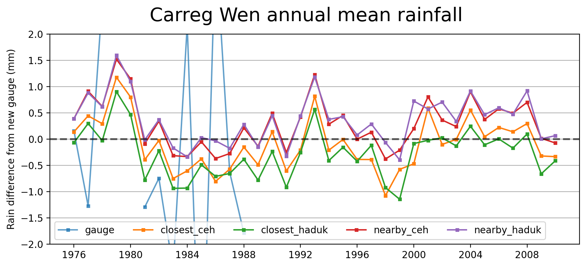

# FDRI-comparing-rainfall-data-in-upper-severn
## Introduction
Project comparing rainfall estimates in the Upper Severn using rain gauges and gridded rainfall products.  
Notebooks provided in `notebooks/` detail how the analysis and figures below were produced

**Project Goal:** To reduce the uncertainty of rain-driven flood estimation in the upper reaches of the Severn catchment.

## **Headline Findings**
- There is a spatial signature to the difference between CEH-GEAR and HadUK-Grid (see **Figures X, X** & **X**)

## Index
- [1. Data](#1-data)  
    - [1.1. Factors contributing to differences in gridded rainfall products](#11-factors-contributing-to-differences-between-ceh-gear--haduk-grid)
- [2. The Upper Severn](#the-upper-severn)  
- [3. Methods](#3-methods)  
    - [3.1 Masking catchment](#31-catchment-masks)
    - [3.2. Height profile](#32-height-profile)
- [4. Results](#4-results)  
- [7. The Upper Severn](#the-upper-severn)  

# 1. Data
**Gridded rainfall data products**  
The two main observation-based gridded rainfall products available for the UK are the CEH-GEAR (available [here](https://catalogue.ceh.ac.uk/documents/dbf13dd5-90cd-457a-a986-f2f9dd97e93c)) and HadUK-Grid (available [here](https://catalogue.ceda.ac.uk/uuid/4dc8450d889a491ebb20e724debe2dfb/)).  
For this project, we use daily 1km by 1km rainfall from each of these products.

## 1.1 Factors contributing to differences between CEH-GEAR & HadUK-Grid
### 1.1.1  A reduction in daily rain gauges in Upper Severn
In the 1980s there used to be more rain gauges in the Upper Severn (see figure below):

*<strong>Figure 2.</strong> Number of gauges in the Upper Severn. Red circles represent daily rain gauges around the Abermule catchment available and used in the CEH-GEAR data product.*   

This puts more uncertainty into the rainfall estimation, and means greater differences are created by the exact methods used to spatially interpolate data from rain gauges to a regular grid (e.g. 1km by 1km).

### 1.1.2 Difference of methods used to grid the rain gauge data
Rain gauge data is interpolated onto a regular grid. The exact gauges which are included differ based on gridded rainfall product.

<!-- Example of rain gauge data onto a regular grid:  
 -->

CEH-GEAR uses [Natural Neighbour Interpolation](https://en.wikipedia.org/wiki/Natural-neighbor_interpolation), HadUK-Grid uses [Inverse Distance Weighting](https://en.wikipedia.org/wiki/Inverse_distance_weighting).

Differences will be subtle, but the choice of spatial interpolation creates uncertainty.
Below a figure shows the differences between spatial interpolation methods (for more see: [DOI:10.5772/65996](https://www.intechopen.com/chapters/52704)):  
<!--  -->

### 1.1.3 Difference in quality control procedures
Both datasets uses differing QC procedures, and may included different rain gauges at different time steps. 

# 2. The Upper Severn
We examine three catchments towards the source of the River Severn:  [Abermule](https://nrfa.ceh.ac.uk/data/station/info/54014) (flow gauge at: 86.8 m), [Dolwen](https://nrfa.ceh.ac.uk/data/station/info/54080) (147.3 m) and [Plynlimon Flume](https://nrfa.ceh.ac.uk/data/station/info/54022) (321.3 m). 

*<strong>Figure 1.</strong> The three catchment used in this study of the Upper Severn*

# 3. Methods
## 3.1 Catchment masks
We mask the areas around each catchment (see example in **Figure X**).  
Details provided in *Section 4* of `notebooks/explore_upper_severn_flood_events.ipynb`.  

## 3.2 Height profile 
We also use a 1km by 1km height profile for the region (see figure below)  

*<strong>Figure 3.</strong> Height profile in metres of the Upper Severn catchment*   

# 4. Results
## 4.1 Differences between
*information about how these plots were produced is provided in [notebooks/explore_differences_in_gridded_dataset.ipynb](./notebooks/explore_differences_in_gridded_dataset.ipynb)*

*<strong>Figure X</strong> Histogram of differences between CEH-Gear and HadUK in Upper Severn*   

Clearly greater bias towards Plynlimon.  

*<strong>Figure X</strong> caption.*   

But there is opposing relationship between height of gauge and differences between CEH-GEAR and HadUK-Grid   

*<strong>Figure X</strong> Rainfall difference between datasets vs Height of rain gauge.*   

Similarly there is no clear pattern between dataset differences and distances of a grid cell to the nearest rain gauge (see below).   

*<strong>Figure X</strong> Rainfall difference between CEH-GEAR and HadUK-Grid versus minimum distance to gauge (from CEH-GEAR).*  

*<strong>Figure X</strong> Height of rain gauge versus minimum distance to gauge.*   

### Interpretation:
- perhaps we are using too much data in one go to compare differences.
- there is some indication that 

# Influence of gridded data differences during floods
We examine 5 major Severn-wide high flow events (i.e. those above 95th percentile in each of the Abermule, Plynlimon, Bewdley, Buildwas and Dolwen catchments).

*<strong>Figure X</strong>*   

*<strong>Figure X</strong>*   

*Finding:*
Clearly there is a large amount of bias within the Plynlimon catchment, next we explore a gauge that was unused in the HadUK-Grid and CEH-GEAR datasets at Carreg-Wen, Plynlimon

## Carreg Wen case study (using unseen data):
The rain gauge at Carreg Wen was not included in either the CEH-GEAR or HadUK-Grid.  

*<strong>Figure X</strong> Location of the daily Carreg Wen gauge.*   

Uncertainty around data from the old Carreg Wen gauge (which was included in CEH-GEAR from 1976-1988)
*'nearby' represents the eight surrounding grid cells*:

*<strong>Figure X</strong> *'nearby' represents the eight surrounding grid cells**   

*<strong>Figure X</strong> Compare nearby grid cells with new Carreg Wen rain gauge.'nearby' represents the eight surrounding grid cells*   

*<strong>Figure X</strong> View rainfall in nearby gauges*   

  

*<strong>Figure X</strong> rainfall differences between gridded datasets and the unseen Carreg Wen gauge*   

*more figures available under `figures/carreg_wen_case_study`*

# Findings
- uncertainty in the Pynlimon region about how much rainfall falls during flood events (also see project examining influence of height on rainfall estimation in gridded rainfall products [here](#https://github.com/Thomasjkeel/FDRI-catchment-contribution-to-floods))

# Further reading:
- https://github.com/Thomasjkeel/FDRI-catchment-contribution-to-floods

# Endnote
*This work was carried out as part of the [Floods and Droughts Research Infrastructure](https://fdri.org.uk/) (FDRI) project led by the UK Centre for Ecology & Hydrology.*

