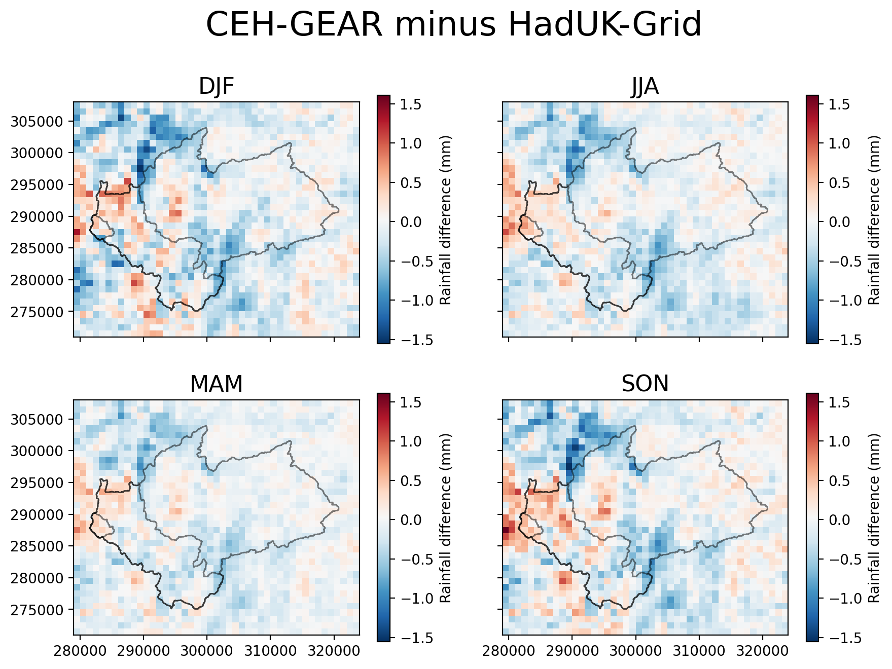
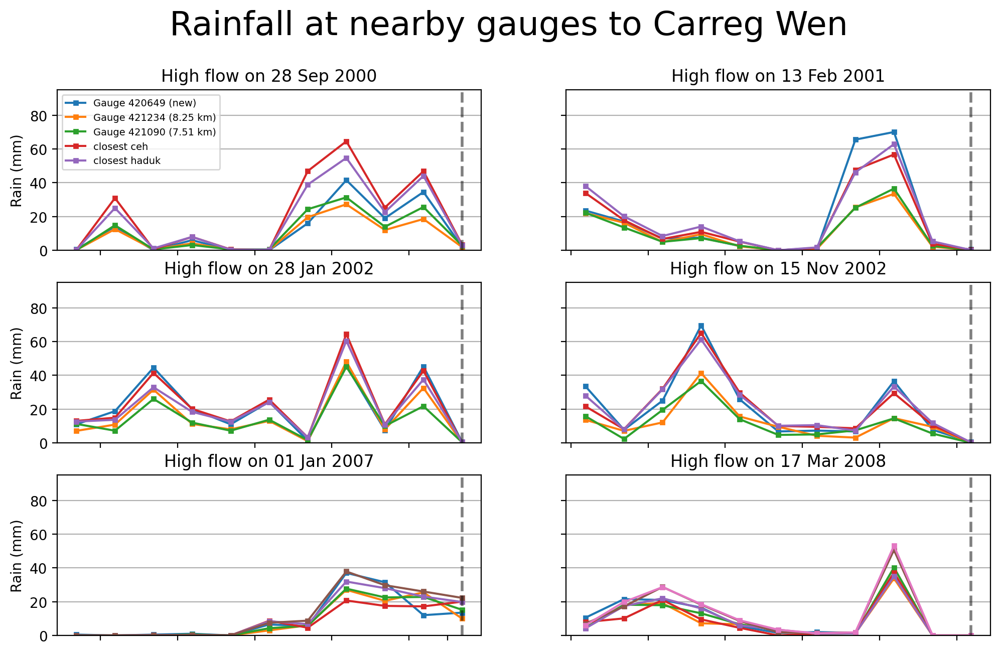
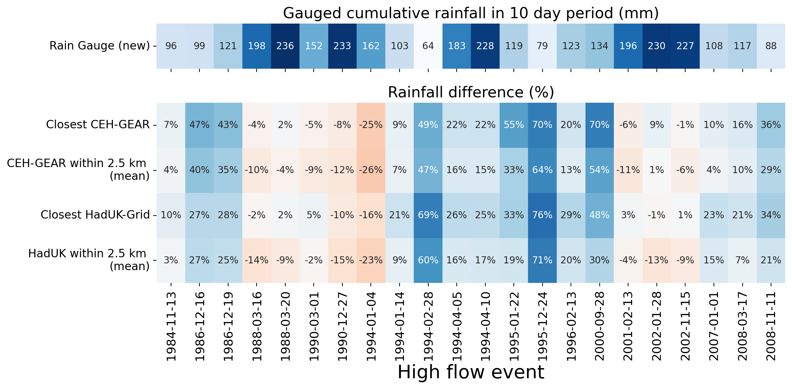

# FDRI-comparing-rainfall-data-in-upper-severn

## Introduction

Project comparing rainfall estimates in the Upper Severn using data from rain gauges and gridded rainfall products.

**Project Goals:**

1. To reduce the uncertainty of rain-driven flood estimates in the upper reaches of the Severn catchment.
2. To quantify the differences between the CEH-GEAR and HadUK-Grid within a river catchment.

## **Headline Findings**

TODO

- There is a spatial signature to the difference between CEH-GEAR and HadUK-Grid (**Figures X, X** & **X**)
- The relationship between changes to the density of rain gauges to differences between gridded data products is uncertain, but there has been a decrease in the number of daily rain gauges in the Upper Severn (**Figure 2**), alongside a relationship between X and X (**Figures X, X** & **X**).

## Index

- [1. Data](#1-data)
- [2. Study area: The Upper Severn](#2-study-area-the-upper-severn)
  - [2.1. Factors contributing to differences in gridded rainfall products in region](#21-factors-contributing-to-differences-between-ceh-gear--haduk-grid-over-upper-severn)
- [3. Methods](#3-methods)
  - [3.1 Masking catchment](#31-catchment-masks)
  - [3.2. Height profile](#32-height-profile)
- [4. Results](#4-results)
  - [4.1. Differences between gridded datasets in Upper Severn](#41-differences-between-gridded-datasets-in-upper-severn)
  - [4.2. Dataset uncertainty during Severn high flow events](#42-dataset-uncertainty-during-severn-high-flow-events)
  - [4.3. Carreg Wen case study](#43-carreg-wen-case-study)
- [5. Discussion](#5-discussion)
- [6. Technical note, further reading, credits](#6-endnotes)

# 1. Data

**UK gridded rainfall products**  
The two main observation-based gridded rainfall products available for the UK are the CEH-GEAR (available [here](https://catalogue.ceh.ac.uk/documents/dbf13dd5-90cd-457a-a986-f2f9dd97e93c)) and HadUK-Grid (available [here](https://catalogue.ceda.ac.uk/uuid/4dc8450d889a491ebb20e724debe2dfb/)). We used daily 1km by 1km rainfall between 1 Jan 1970 and 31 Dec 2022 from each of these products. A spatial and time subset of these dataset was extracted from UKCEH servers and CEDA JASMIN respectively.

**Daily rain gauge data**  
This has been extracted from internal UKCEH servers, and includes quality controlled data from Met Office rain gauges. This data is available in `gauge_data/`.

**NRFA catchment boundaries**  
Downloaded from NRFA ([link](https://nrfa.ceh.ac.uk/data/search))

**Rivers shapefile**  
Downloaded from OS OpenRivers ([link](https://www.ordnancesurvey.co.uk/products/os-open-rivers))

🌲 _I am happy to provide any of the above data (or any related info), so please feel free to email [me](mailto:tomkee@ceh.ac.uk)._ 🌲

# 2. Study area: The Upper Severn

We use three NRFA catchments towards the source of the River Severn: [Abermule](https://nrfa.ceh.ac.uk/data/station/info/54014) (flow gauge at: 86.8 m), [Dolwen](https://nrfa.ceh.ac.uk/data/station/info/54080) (147.3 m) and [Plynlimon Flume](https://nrfa.ceh.ac.uk/data/station/info/54022) (321.3 m).

_**Figure 1.** The three catchment used in this study of the Upper Severn_

## 2.1 Factors contributing to differences between CEH-GEAR & HadUK-Grid over Upper Severn

### 2.1.1 A reduction in daily rain gauges in Upper Severn

On 1 January 1980 there were more rain gauges in the Upper Severn around Abermule than on 1 January 2022 (**Figure 2**).
Additionally, the proportion of rain gauges used in both the daily and monthly CEH-GEAR product becomes 100% in 2022.

_**Figure 2.** Number of daily rain gauges around Abermule. Red circles represent daily-only rain gauges, yellow circles represent gauges used in daily and monthly CEH-GEAR product._

### 2.1.2 Difference of methods used to grid the rain gauge data

Rain gauge data is interpolated onto a regular grid differently by the two gridded products (see **Figure 3**). CEH-GEAR uses [Natural Neighbour Interpolation](https://en.wikipedia.org/wiki/Natural-neighbor_interpolation), HadUK-Grid uses [Inverse Distance Weighting](https://en.wikipedia.org/wiki/Inverse_distance_weighting).
The differences will be subtle, but the choice of spatial interpolation creates uncertainty (see: [DOI:10.5772/65996](https://www.intechopen.com/chapters/52704)).

_**Figure 3.** Example of spatial interpolation of rain gauges network to a regular grid_

Another issues is that the exact gauges which are included differ based on gridded rainfall product.
The reduction in density of the rain gauge network in the Upper Severn (shown in **Figure 2**) puts more uncertainty into the rainfall estimation, and means larger differences are created by the exact methods used to spatially interpolate data from rain gauges to a regular grid (e.g. 1km by 1km).

### 2.1.3 Difference in quality control procedures

Both datasets uses differing QC procedures, and may included different rain gauges at different time steps.
The QC methodologies are noted in the following sections of the data paper:
CEH-GEAR (Section 4 of [Keller et al. 2015](https://doi.org/10.5194/essd-7-143-2015)) & HadUK-Grid (Section of [Hollis et al. 2019](https://rmets.onlinelibrary.wiley.com/doi/10.1002/gdj3.78))

🌲 _I am happy to discuss the QC protocols further, and a more robust rain QC protocol for hourly data is provided in [Lewis et al. 2021](https://doi.org/10.1016/j.envsoft.2021.105169)_ 🌲

# 3. Methods

Notebooks provided in `notebooks/` detail how the analysis and figures were produced.

## 3.1 Catchment masks

We mask the areas around each catchment (see example in **Figure 6**). More details of masking is provided in _Section 4_ of `notebooks/explore_upper_severn_flood_events.ipynb`.

## 3.2 Height profile

We also use a 1km by 1km height profile for the region (**Figure 4**). This was extracted using 50 metre OS topography data and clipping by extent in QGIS. The data was then exported to a 1km by 1km grid.

_**Figure 4.** Height profile in metres of the Upper Severn catchment_

# 4. Results

## 4.1 Differences between gridded datasets in Upper Severn

The Abermule catchment encompasses the other two, and in this wider catchment there is larger HadUK-Grid bias (**Figure 5**). However, there is a longer tail in the CEH-GEAR bias, likely attributed to grid cells in areas in the smaller catchments of Dolwen and Plynlimon Flume.

_**Figure 5** Histogram of differences between CEH-Gear and HadUK in Upper Severn. Histogram bins are every 5 mm difference._

There is also a clear spatial pattern of bias shown in the upper severn (**Figure 6**), and this pattern is not seasonally dependent (**Figure 7**).  

_**Figure 6** Mean dataset difference in the Upper Severn using a region mask._

_**Figure 7** Seasonal dataset differences in the Upper Severn between 1 Jan 1970 and 31 Dec 2022._

#### 4.1.1 Is there relationship between gridded data differences and the location of the underlying rain gauges?

Next, we examine some simple relationships between grid cell height, gridded data differences and minimum distances to the nearest rain gauge (CEH-GEAR only).

A slight negative correlation is shown between grid cell height and rainfall differences in Abermule, but not for the other catchments (**Figure 8**). A similar pattern is shown between the minimum distance to the nearest rain gauge and rainfall differences (**Figure 9**).
Comparison between grid cell height and min distance are shown in this [figure](figures/ceh_vs_haduk_differences/uppersevern_height_vs_mindist_scatter.png) (in that there is a strong positive correlation between height and min dist in both Dolwen and Plynlimon).

_**Figure 8** Rainfall data difference vs height of grid cell (mean of 1 Jan 1970 to 31 Dec 2022). Height was dervied from a 1 km by 1 km profile detailed in **Section 3.2**._

_**Figure 9** Rainfall data difference vs minimum distance to gauge from CEH-GEAR (mean of 1 Jan 1970 to 31 Dec 2022)._

#### 4.1.2 Is there temporal relationship between gridded data differences and the distances to gauge or altitude?

There has been a gradual reduction in the number of gauges in the Upper Severn (_fourth panel_ of **Figure 10**) and this has coincided with a slight jump in the variability of the difference between CEH-GEAR & HadUK-Grid in Plynlimon and to a lesser extent Abermule (_second panel_ of **Figure 10**). No pattern or change in min dist to gauge was shown in Dolwen.

A version of this plot without Plynlimon Flume is available [here](figures/ceh_vs_haduk_differences/ceh_vs_haduk_thru_time_wo_plyn.png)

_**Figure 10** Comparison of dataset differences and inputted rain gauge information across the study period._

### Code for these figures

- Information about how the above plots were produced is provided in [notebooks/explore_differences_in_gridded_datasets.ipynb](./notebooks/explore_differences_in_gridded_datasets.ipynb)\_

# 4.2 Dataset uncertainty during Severn high flow events

We examine 6 major Severn-wide high flow events between 2000-2008. High flow events are defined as [gauged daily flow](https://nrfa.ceh.ac.uk/data/about-data/daily-flow-data/gauged-daily-flow-data) above the 95th percentile in each of the [Bewdley](https://nrfa.ceh.ac.uk/data/station/info/54001), [Buildwas](https://nrfa.ceh.ac.uk/data/station/info/54095) and [Montford](https://nrfa.ceh.ac.uk/data/station/info/54005) catchments. By focusing on three catchments, we hope to caputre events that co-occured across the Severn.

There is no clear spatial pattern of dataset uncertainty about rainfall leading up to high flow events in the Upper Severn (**Figure 11**).
However, there is slightly more uncertainty towards Plynlimon Flume and high altitude regions (**Figure 4**).

For a further six high flow events see this [figure](figures/upper_severn_floods/uppersevern_flood_events_differences_6latest.png). And to see a map of minimum distances to gauge during these events see this [figure](figures/upper_severn_floods/uppersevern_flood_events_differences_mindist.png).

_**Figure 11** High flow events over the Upper Severn. In each case, a dated event is the mean of 10 to 0 days before it._

#### 4.2.1 Is there relationship between gridded data differences for these high flow events and the distances to gauge or altitude?

There is no consistent pattern between the difference in rainfall in CEH-GEAR vs HadUK-Grid and minimum distance to gauge (**Figure 12**) in any of the three catchments.

Similarly, there is not much pattern between rainfall differences and grid cell height (**Figure 13**).
The one exception is high grid cell height is found to be associated with more HadUK-Grid bias across the flood events in Abermule only.
There is some seperation between grid cells in Abermule and Plynlimon.

_**Figure 12** Comparison between minimum distance to gauge and gridded data differences in the grid cells of each of the three Upper Severn catchments. In each case, a dated event is the mean of 10 to 0 days before it._

_**Figure 13** Comparison between grid cell height and gridded data differences in the grid cells of each of the three Upper Severn catchments. In each case, a dated event is the mean of 10 to 0 days before it._

### Interpretation

- Clearly there is a large amount of bias within the Plynlimon catchment, next we explore a gauge that was unused in the HadUK-Grid and CEH-GEAR datasets at Carreg-Wen, Plynlimon
- There is some seperation between grid cells in Abermule and Plynlimon.

### Code for these figures

- Information about how the above plots were produced is provided in [notebooks/explore_differences_in_gridded_datasets.ipynb](./notebooks/explore_upper_severn_high_flow_events.ipynb)

## 4.3 Carreg Wen case study

The rain gauge at Carreg Wen was not included in either the CEH-GEAR or HadUK-Grid.  

_**Figure X** Location of the daily Carreg Wen gauge._

Uncertainty around data from the old Carreg Wen gauge (which was included in CEH-GEAR from 1976-1988)
_'nearby' represents the eight surrounding grid cells_:

_**Figure X** _'nearby' represents the eight surrounding grid cells\*\*

_**Figure X** Compare nearby grid cells with new Carreg Wen rain gauge.'nearby' represents the eight surrounding grid cells_

_**Figure X** View rainfall in nearby gauges_

_**Figure X** rainfall differences between gridded datasets and the unseen Carreg Wen gauge_

_more figures available under `figures/carreg_wen_case_study`_

### Interpretation

- Carreg Wen represented a blind spot for rainfall estimates in the Upper Severn, which was biased towards CEH-GEAR

### Code for these figures

- Information about how the above plots were produced is provided in [notebooks/explore_differences_in_gridded_datasets.ipynb](./notebooks/Carreg_wen_case_study.ipynb)\_

# 5. Discussion

- uncertainty in the Pynlimon region about how much rainfall falls during high-flow events (also see project examining influence of height on rainfall estimation in gridded rainfall products [here](#https://github.com/Thomasjkeel/FDRI-catchment-contribution-to-floods))

# 6. Endnotes

## Technical note

There are few heavier libraries used in this project that may be awkward for new users, but are commonly-used libraries for dealing with multi-dimensional (spatial) data in Python. These are:

| library   | use                                 | version  |
| --------- | ----------------------------------- | -------- |
| xarray    | loading, subsetting, multi-dim data | 2025.1.1 |
| pandas    | loading data                        | 2.2.3    |
| polars    | loading data (fast)                 | 1.19.0   |
| geopandas | loading shapefiles                  | 1.0.1    |
| rioxarray | loading raster data                 | 0.18.2   |
| shapely   | spatial operations                  | 2.0.6    |
| seaborn   | plotting                            | 0.13.2   |
| scipy     | statistics                          | 1.15.0   |

## Further reading

- https://github.com/Thomasjkeel/FDRI-catchment-contribution-to-floods

## Disclaimer

_We have only used rain gauge information related to the CEH-GEAR product_

## Credits

_This work was carried out as part of the [Floods and Droughts Research Infrastructure](https://fdri.org.uk/) (FDRI) project led by the UK Centre for Ecology & Hydrology._
