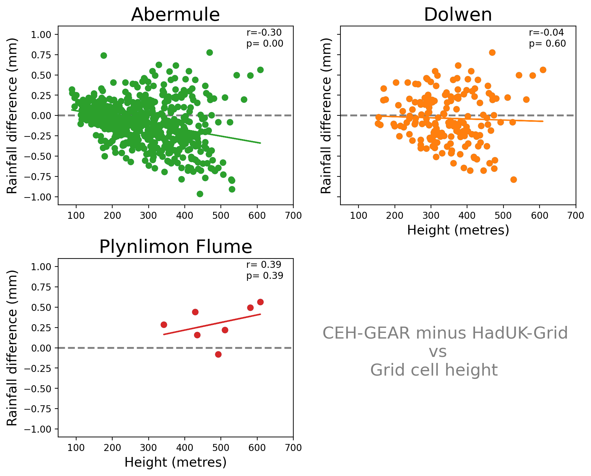
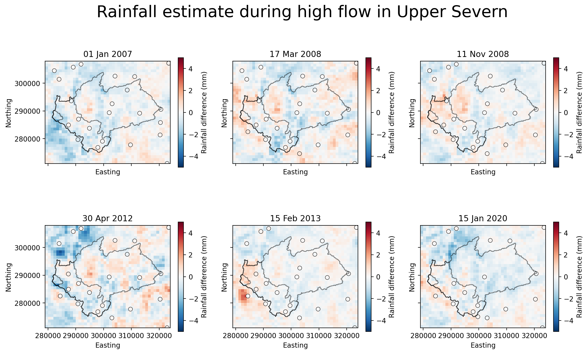
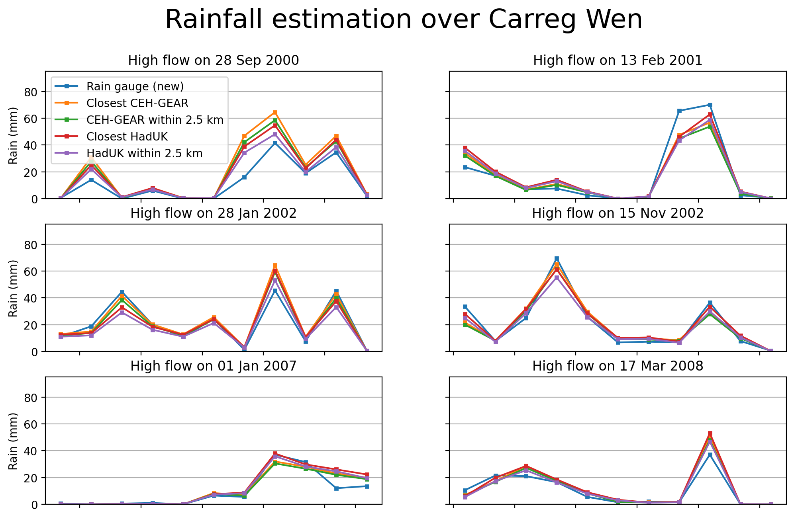

# FDRI-comparing-rainfall-data-in-upper-severn
Project comparing rainfall estimates in the Upper Severn using rain gauges and gridded rainfall products. 

**Project Goal:** To reduce the uncertainty of rain-driven flood estimation in the upper reaches of the Severn catchment.

*This work was carried out as part of the [Floods and Droughts Research Infrastructure](https://fdri.org.uk/) (FDRI) project led by the UK Centre for Ecology & Hydrology.*

## The Upper Severn
We examine three catchments towards the source of the River Severn:  [Abermule](https://nrfa.ceh.ac.uk/data/station/info/54014) (flow gauge at: 86.8 m), [Dolwen](https://nrfa.ceh.ac.uk/data/station/info/54080) (147.3 m) and [Plynlimon Flume](https://nrfa.ceh.ac.uk/data/station/info/54022) (321.3 m). 

## Gridded rainfall data products
The two main observation-based gridded rainfall products available for the UK are the CEH-GEAR (available [here](https://catalogue.ceh.ac.uk/documents/dbf13dd5-90cd-457a-a986-f2f9dd97e93c)) and HadUK-Grid (available [here](https://catalogue.ceda.ac.uk/uuid/4dc8450d889a491ebb20e724debe2dfb/)). For this project, we use daily 1km by 1km rainfall from each of these products.

# Factors contributing to differences between CEH-GEAR & HadUK-Grid
## Reduction in daily rain gauges in Upper Severn
In the 1980s there used to be more rain gauges in the Upper Severn (see figure below):
*Red circles represent daily rain gauges around the Abermule catchment available and used in the CEH-GEAR data product.*

This puts more uncertainty into the rainfall estimation, and means greater differences are created by the exact methods used to spatially interpolate data from rain gauges to a regular grid (e.g. 1km by 1km).

## Gridding methods
Rain gauge data is interpolated onto a regular grid. The exact gauges which are included differ based on gridded rainfall product.

<!-- Example of rain gauge data onto a regular grid:  
 -->

CEH-GEAR uses [Natural Neighbour Interpolation](https://en.wikipedia.org/wiki/Natural-neighbor_interpolation), HadUK-Grid uses [Inverse Distance Weighting](https://en.wikipedia.org/wiki/Inverse_distance_weighting).

Differences will be subtle, but the choice of spatial interpolation creates uncertainty.
Below a figure shows the differences between spatial interpolation methods (for more see: [DOI:10.5772/65996](https://www.intechopen.com/chapters/52704)):  
<!--  -->

## Quality control procedures
Both datasets uses differing QC procedures, and may included different rain gauges at different time steps. 

# Exploring differences
## Methods
We mask the areas around each catchment

We also use a 1km by 1km height profile for the region

## Results
Histogram of differences between CEH-Gear and HadUK in Upper Severn:  

Rainfall difference between CEH-GEAR and HadUK vs Height of rain gauge.  

Rainfall difference between CEH-GEAR and HadUK versus minimum distance to gauge (from CEH-GEAR).  

Height of rain gauge versus minimum distance to gauge (from CEH-GEAR).  

# Influence of gridded data differences during floods
We examine 5 major Severn-wide high flow events (i.e. those above 95th percentile in each of the Abermule, Plynlimon, Bewdley, Buildwas and Dolwen catchments).

*Finding:*
Clearly there is a large amount of bias within the Plynlimon catchment, next we explore a gauge that was unused in the HadUK-Grid and CEH-GEAR datasets at Carreg-Wen, Plynlimon

## Carreg Wen case study (using unseen data):
The rain gauge at Carreg Wen was not included in either the CEH-GEAR or HadUK-Grid.
Location of the daily Carreg Wen gauge:  

Uncertainty around data from the old Carreg Wen gauge (which ran from 1976-1988):

Compare nearby grid cells with new Carreg Wen rain gauge

View rainfall in nearby gauges

Examine rainfall differences between gridded datasets and the unseen Carreg Wen gauge

*more figures available under `figures/carreg_wen_case_study`*

# Findings
- uncertainty in the Pynlimon region about how much rainfall falls during flood events (also see project examining influence of height on rainfall estimation in gridded rainfall products [here](#https://github.com/Thomasjkeel/FDRI-catchment-contribution-to-floods))

